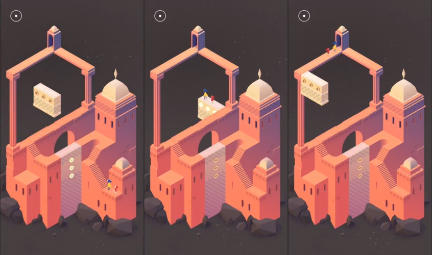
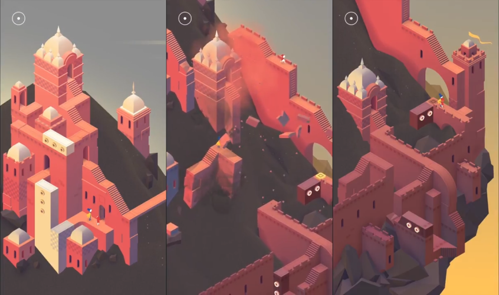
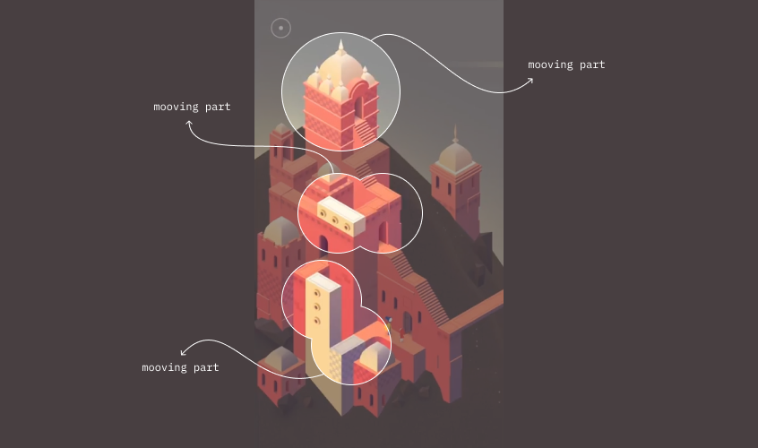
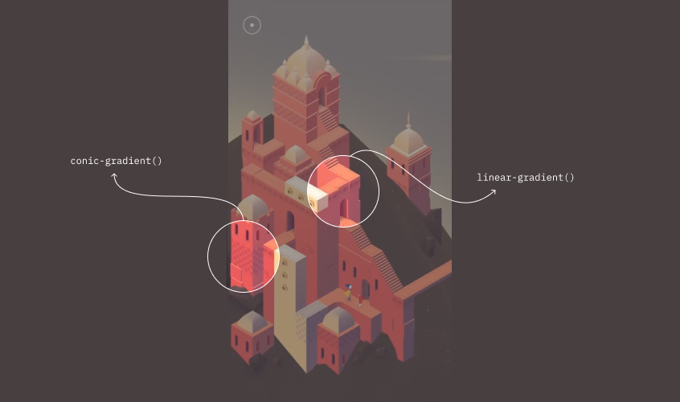
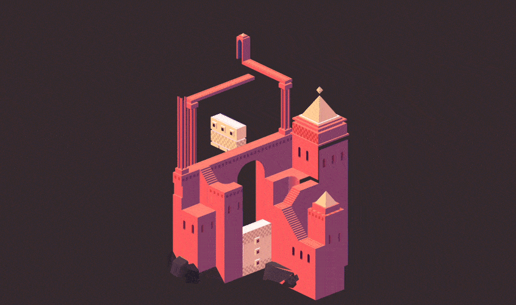
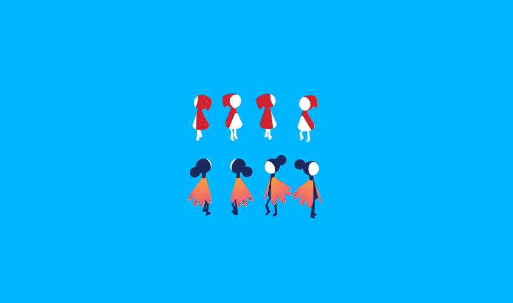

# Monument Valley II

November 27, 2020 | [watch on CodePen](https://codepen.io/miocene/pen/NWRWQpX)


## Introduction
I've already done many flat animations, but I'm not very interested in realistic ones yet. I didn't want to do pixel art at that time either. So I decided to try to work with CSS 3D. Before that, the maximum I did in 3D was a cube. I wanted to test what CSS is capable of. And I wanted to try my strength.

First, I chose a reference — Monument Valley "The Oasis" level. I liked that it has drama - a perfect plot for a Hollywood movie: two characters live their lives, but something separates them, they cope with this problem and reunite. I have never done such complex and long plots. It was definitely a challenge for me.

## Step 1. Cut the original video for clear visual timeline
I found a [record](https://youtu.be/qASbo9-8Gkw) of passing a level of good quality. But there have been unsuccessful attempts, pauses, repetitive actions, and other scenes after the credits. Here, look, several shots. It was possible not to cut the video but to do everything by eye. But because the plot is very long, I had to focus on some kind of visual timeline.

I cut out everything that got in the way of putting together a coherent plot. The result is a video for ninety seconds.

## Step 2. Split it on scenes and plans
Next I divided the plot into scenes. Here is the first part, where the characters just live their lifes, go for this beautiful fairy-tale world.



And there is a second scene where the action takes place.



At first, I thought that part of the reunion of the heroes could be separated into a separate scene. In the process, I realized that it was not. They have shared parts of buildings. They are interconnected. Each location is living in its 3D space — and there is no transition from one to another. Therefore, we will not be able to logically divide the entire plot into three parts. I ended up with the first short and static part and the second most intensely plotted.

## Tools
Each of these scenes consists of moving and static parts. Markup the static elements first. To do this, I took any frame and redraw it in the browser.



To split a GIF or video into frames, I use either Photoshop for big files or the [ezgif.com](https://ezgif.com) site. And I use the [PixelPerfect](https://chrome.google.com/webstore/detail/perfectpixel-by-welldonec/dkaagdgjmgdmbnecmcefdhjekcoceebi?hl=ru) Chrome extension to redraw in the browser. For painting, I use DevTools in Chrome browser.

## Step 3. Set perspective
First, we need to indicate that the scene is 3D. There are two steps to do this: perspective and transform-style properties.

```css
    .scene    { perspective: 100000px; }
    .building { transform-style: preserve-3d; }
```

Each time the question arises: how much big should be the number for the perspective. It depends on how close to us the point of intersection of the axes is. The closer — the lower the number, the further — the larger. The most suitable value for the game is a 100000.

From the beginning, I used a 1em modulus of 4px to construct the surfaces. This is a bit simplified calculation. But now I understand that it was possible to choose a larger module. Next, I described simple rectangles that made up the walls, floor, and ceiling. 

```css
    .scene { font-size: 4px; }
    .wall  { width: 10em; }
```

To avoid using compound shapes, I used a clip-path. I reproduced the arches point by point using a clip-path. Yes, there are a lot of points. It's hard to work with them. But it was a great experiment.

```css
    .arch {
        clip-path: polygon(0em 0em, 72em 0em, 72em 28em, 46em 28em, 46em 18em, 45em 15em, 44em 13em, 43em 11.7em, 42em 10.6em, 41em 9.8em, 40em 9.1em, 39em 8.6em, 37em 8em, 35em 8em, 31em 8.3em, 30em 8.5em, 29em 8.9em, 27em 10.1em, 26em 11.1em, 25em 12.3em, 24em 13.7em, 23.4em 15.5em, 23em 30em, 0em 30em);
    }
```

Another interesting thing about the buildings is a drawing - a chessboard print. This is a conical and linear gradients where the starting point of the gradient and its size are specified.



```css
    .chessboard-one-line {
        background: linear-gradient(90deg, transparent 50%, red 51%) 0 2em / 3em 1.5em repeat-x;
    }
    .chessboard-block {
        background: conic-gradient(transparent 90deg, red 91deg, red 180deg, transparent 180deg, transparent 270deg, red 271deg) 0 0 / 3em 3em repeat;
    }
```

Separately, I drew the moving objects. This is important because statics can be marked with a minimum number of objects, squeezing the maximum out of CSS. And dynamics is always a separate object. It must be in the right place, be of the right size, and when driving, do not block anything and stick out in unexpected places.

## Step 4. Impossible object
Monument Valley is known for the fact that all the figures in it are unreal. And this cannot be implemented in any way except to imitate a real impossible object. If I rotate this composition, it will be obvious that this is just a good angle of view.



## Step 5. Draw characters separately
So I first collected all the buildings in both scenes, then moved on to the characters.

The characters took the most of my time. I have taken several approaches to find the ideal realization of Ro and the Child. If you draw them in the same perspective as the buildings, they look entirely unnatural and unlike the original. Note that Ro and the baby are always the same sizes. And if you move them in the perspective of the castle, then they change their size constantly.

I tried to morph them in every possible way, but it turned out to be nonsense. As a result, I rendered the characters on a separate 2D layer. This made it easier for me to work with them.

Ro and the Child walk in three directions. Due to the fact that they actually live in 2D space, they cannot be rotated. This means that each object of the character must hide in itself three Ro and three children. To work on such moments, I am putting together a separate demo with larger characters.



There are kinds of essential points in animation characters: correct markings and correctly indicated anchor points.

Think of a ball-jointed doll or books on the structure of the body. All moving parts of the body are connected to each other by joints that allow movement. Here you need to do the same. The root object is Ro, and this is where you draw the torso. The hips, shoulders, and head are embedded in the torso because they are connected to the body by joints. Elbows lie in the shoulders, palms in the elbows. By analogy, we mark the legs. Add styles to the markup. And add a joint to each object - an anchor point. Transform-origin specifies the point from which the object will change.


7_BJD.png

```css
    .leg { transform-origin: 13px 13px; }
```

## Step 6. Animating
When I had drawn everything, I started animating.

So there are many animated objects. I create a variable in which I describe the length of the animation, repeat, and timing-function.

```css
    --animation: 90s linear infinite;
```

In CSS, the animation length is specified in seconds, and frames as a percentage of the animation length. To calculate the frame length, divide 100% by the number of frames. Here we have the length of one frame.

## Step 7. Debugging
I type everything right in the browser using DevTools. Chrome has a separate tab for animation debugging. But this tab has bare functionality. But at least it is there, and it's good. It has a Timeline for each animation on the page with all frames. These points can be moved, the entire animation can be slowed down or stopped. When I have a ninety-second animation with a bunch of frames, it is simply impossible to debug the animation at the very end. Therefore, I test each logical block as soon as I make it. Then do not get confused in devtools.

## Result
So, I found a reference, cut out the excess. I Broke into scenes and plans. Layout the static parts, then the moving ones. Next, I laid out Ro and the Child in a separate layer in three projections. Animated everything. I tweaked all the pieces and checked for cross-browser compatibility, just in case.

In the end, after five months of trying, I got this.

## What is this all for?

What I hear most often is, "Well, why do you need this? All the same, it cannot be applied anywhere. "

Well, first of all, it's beautiful. Secondly, this is a fantastic way to learn something new and test the language's strength and your capabilities. Third, it's an excellent way to switch to something else and not burn out at work.

Everything that I animate and draw in one way or another affects my work. I use some small tricks all the time. For example, tools like Lottie generate pretty messy code. And in my projects, the speed of the interface is important. Therefore, knowledge of CSS animations helps me not use ready-made tools but write optimized animations myself.

In general, this is an excellent way to learn the language for beginners or designers. Because the result is immediately visible, you can try something more complicated than a button. And it's fun.