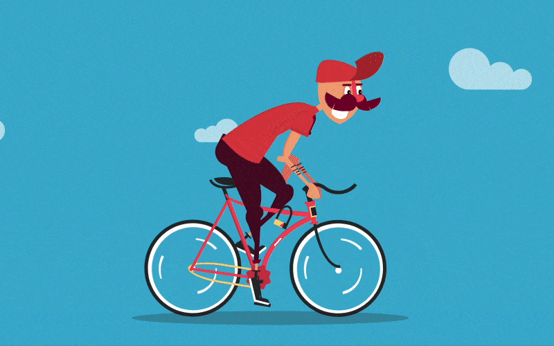
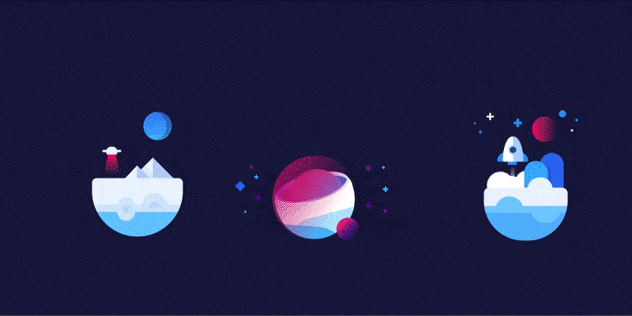
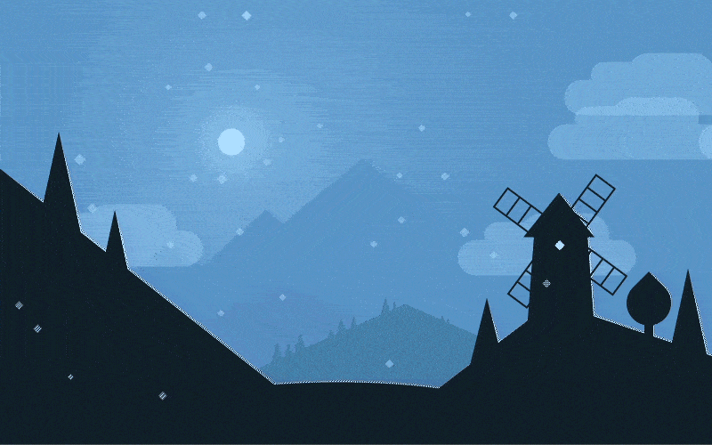

# This is the archive of my Pure CSS Animations

> All this animations you can also find on [my Codepen page](https://codepen.io/miocene/)

## [Monument Valley II](14_mv/mv.md)
November 27, 2020

## [Tractor](13_tractor/tractor.md)
April 23, 2020

## [Eye](12_eye/eye.md)
April 12, 2020

## [Birthday Pen](11_rabbit-party/rabbit-party.md)
December 26, 2018

## [Moustached Nanny](10_nanny/nanny.md)
August 2, 2018

## [4 Designers](9_designers/designers.md)
April 29, 2018

## [SWAT](8_swat/swat.md)
August 27, 2017

## [Biker](7_biker/biker.md)
August 20, 2017

## [Pigeons](6_pigeons/pigeons.md)
August 9, 2017

<!--  -->

## [Sponge](5_sponge/sponge.md)
July 30, 2017

## [Little Universe](4_little-universe/little-universe.md)
July 15, 2017

## [Smiling Planet](3_smiling-planet/smiling-planet.md)
June 25, 2017

## [Windmill](2_windmill/windmill.md)
June 25, 2017

## [BB-8](1_bb-8/bb-8.md)
June 25, 2017

## Simple CSS Figures